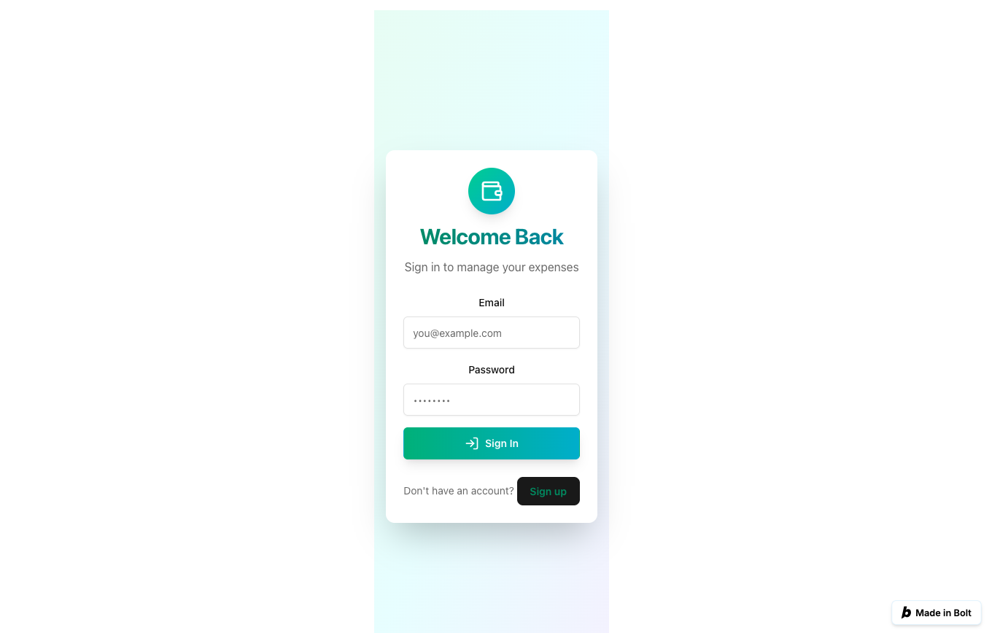
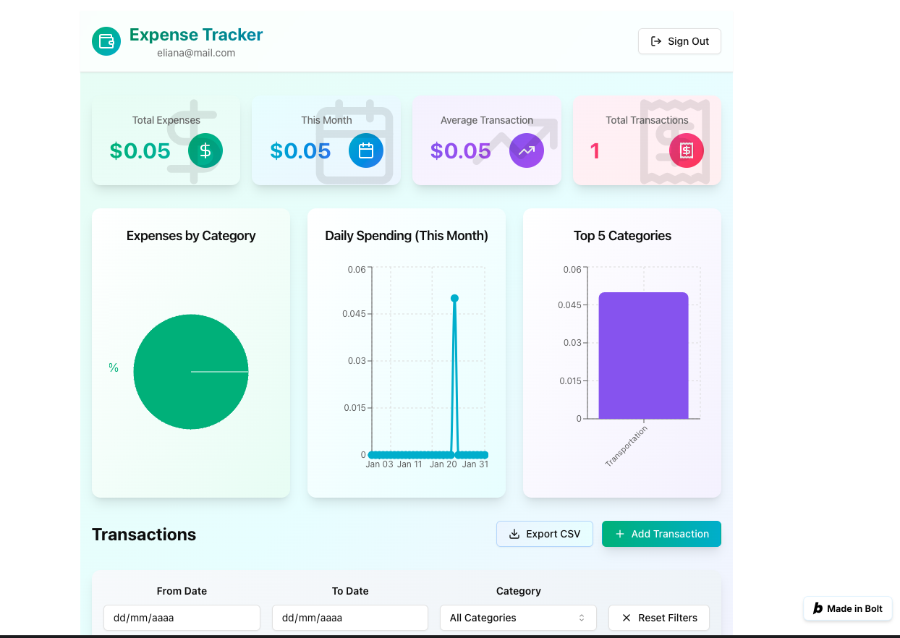
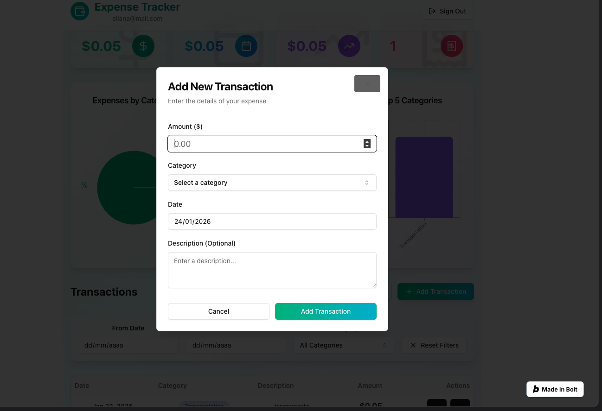
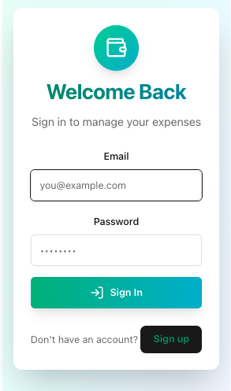
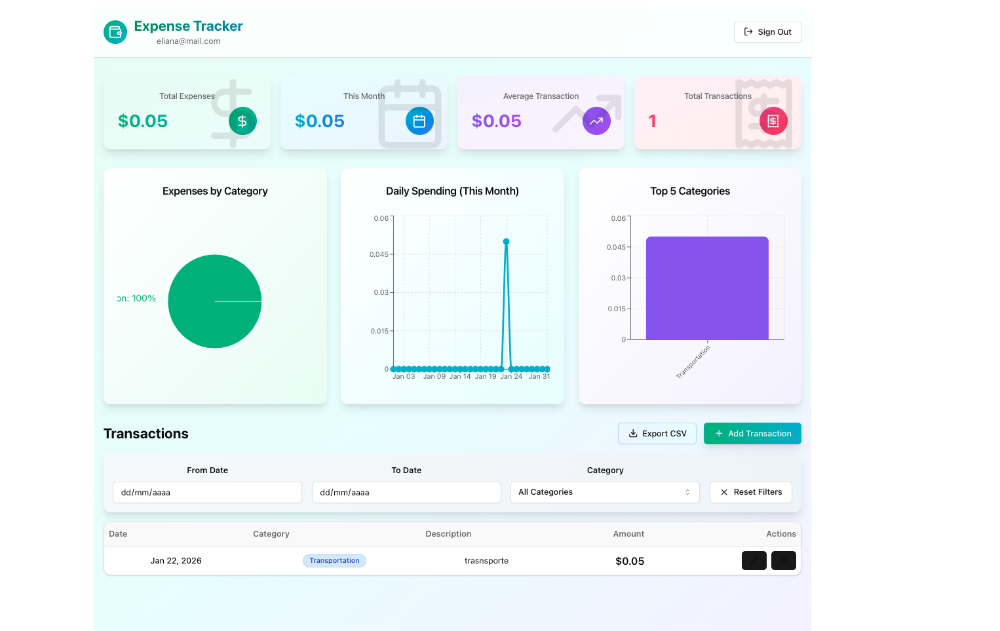
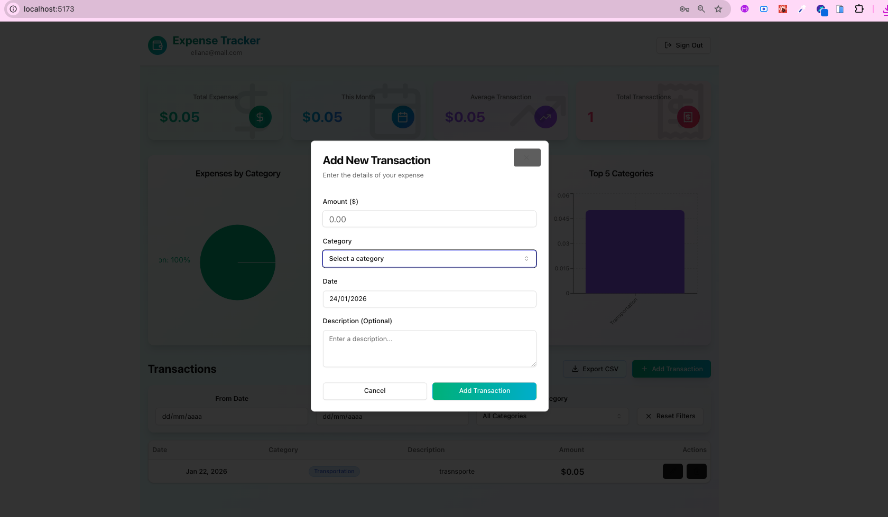
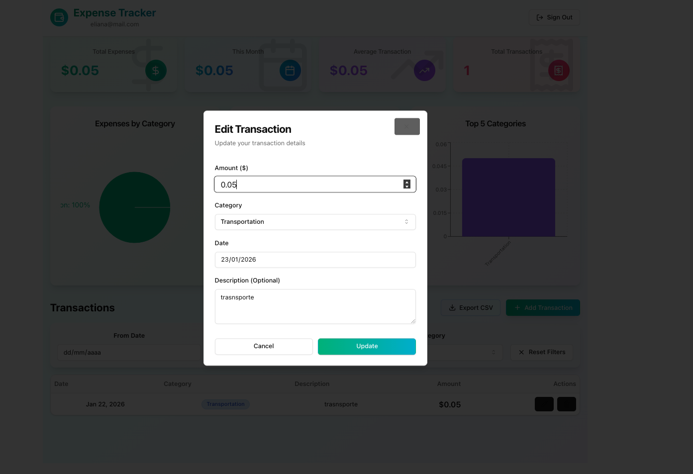
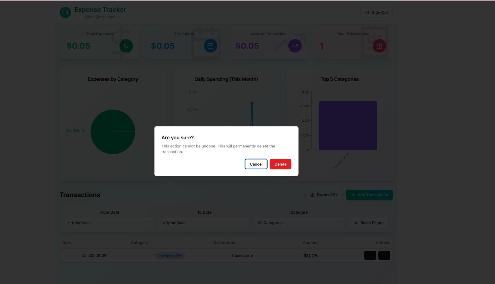

# Expense Tracker

A complete and professional expense tracking application built with React, TypeScript, Tailwind CSS, shadcn/ui, and Supabase. Live demo: https://react-tailwind-expen-krl3.bolt.host

## Screenshots

**Initial**
- Login: docs/screenshots/inicial/Login_image.png
- Dashboard: docs/screenshots/inicial/dashboard_image.png
- Add Transaction modal: docs/screenshots/inicial/NewTransaction_image.png





**Final**
- Login: docs/screenshots/final/LoginFinal.png
- Dashboard: docs/screenshots/final/DashboardFinal.png
- Add Transaction modal: docs/screenshots/final/NuevaTransaccion.png
- Edit Transaction modal: docs/screenshots/final/EditarTransaccion.png
- Delete confirmation: docs/screenshots/final/EliminarTransaccion.png







## Features

- **Authentication**: Secure login and registration with Supabase
- **Dashboard**: Visual charts showing expenses by category and over time using Recharts
- **Full CRUD**: Create, Read, Update, and Delete transactions with amount, category, date, and description
- **Filters**: Filter transactions by date range and categories
- **Export**: Export filtered data to CSV format
- **Modern Design**: Beautiful, colorful interface with gradients and responsive layout

## Setup Instructions

### 1. Install Dependencies

```bash
npm install
```

### 2. Configure Supabase

Create a `.env` file in the root directory with your Supabase credentials (the URL must include `https://`):

```env
VITE_SUPABASE_URL=https://your-project.supabase.co
VITE_SUPABASE_ANON_KEY=your_supabase_anon_key
```

Add `.env.example` to the repo with the same variable names and placeholder values so others can configure quickly.

If you see `Invalid supabaseUrl`, verify the URL starts with `https://`, matches your project, restart `npm run dev`, and try in an incognito window to avoid cached envs.

### 3. Run the Application

```bash
npm run dev
```

The application will be available at `http://localhost:5173`

### 4. Run Tests

```bash
npm test
```

## Usage

### Authentication

1. **Sign Up**: Create a new account with your email and password (minimum 6 characters)
2. **Sign In**: Log in with your credentials

### Managing Transactions

1. **Add Transaction**: Click the "Add Transaction" button to create a new expense
   - Enter the amount
   - Select a category
   - Choose a date
   - Add an optional description

2. **View Transactions**: All transactions are displayed in a table with:
   - Date
   - Category (color-coded)
   - Description
   - Amount

3. **Edit Transaction**: Click the edit (pencil) icon to modify a transaction

4. **Delete Transaction**: Click the delete (trash) icon to remove a transaction

### Filters

Use the filter section to:
- Filter by date range (from/to dates)
- Filter by specific category
- Reset all filters with the "Reset Filters" button

### Export Data

Click the "Export CSV" button to download your filtered transactions as a CSV file for use in Excel, Google Sheets, or other applications.

### Dashboard Charts

The dashboard includes three interactive charts:
1. **Expenses by Category**: Pie chart showing percentage breakdown
2. **Daily Spending**: Line chart showing daily expenses for the current month
3. **Top 5 Categories**: Bar chart displaying your highest expense categories

### Statistics Cards

View key metrics at a glance:
- Total Expenses
- This Month's Expenses
- Average Transaction Amount
- Total Number of Transactions

## Categories

The application includes the following expense categories:
- Food & Dining
- Transportation
- Shopping
- Entertainment
- Bills & Utilities
- Healthcare
- Education
- Travel
- Groceries
- Other

## Folder hints
- Place screenshots under `docs/screenshots/inicial/` and `docs/screenshots/final/` using the names referenced above.
- Keep your `.env` local (gitignored); commit only `.env.example`.

## Technology Stack

- **Frontend**: React 18 + TypeScript
- **Styling**: Tailwind CSS + shadcn/ui components
- **Charts**: Recharts
- **Database**: Supabase (PostgreSQL)
- **Authentication**: Supabase Auth
- **Build Tool**: Vite
- **Icons**: Lucide React
- **Date Handling**: date-fns

## Database Schema

The application uses a single `transactions` table with Row Level Security (RLS) enabled:

```sql
transactions (
  id: uuid (primary key)
  user_id: uuid (foreign key to auth.users)
  amount: numeric(10, 2)
  category: text
  date: date
  description: text
  created_at: timestamptz
  updated_at: timestamptz
)
```

RLS policies ensure users can only access their own transactions.

## Build for Production

```bash
npm run build
```

The production build will be created in the `dist` directory.

## Author
- Eliana Suancha Guzman

## License

MIT
